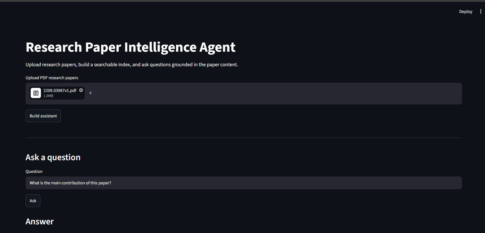
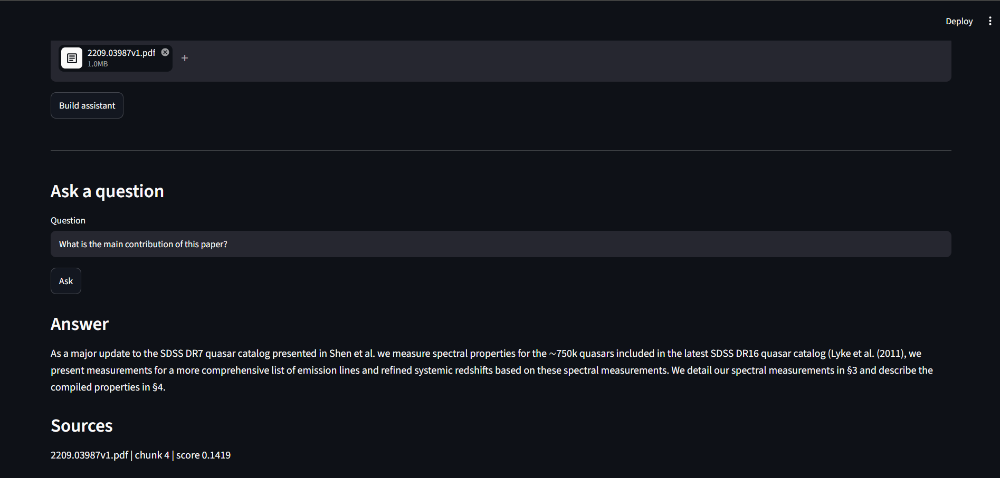
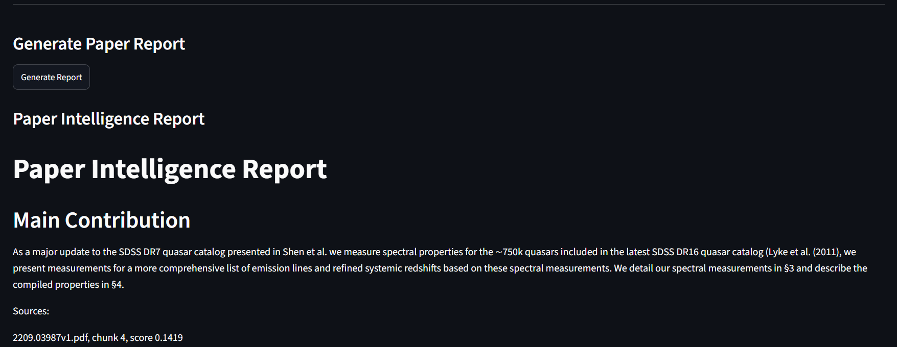
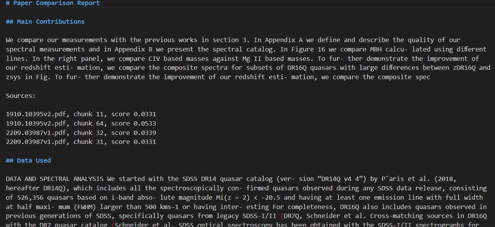
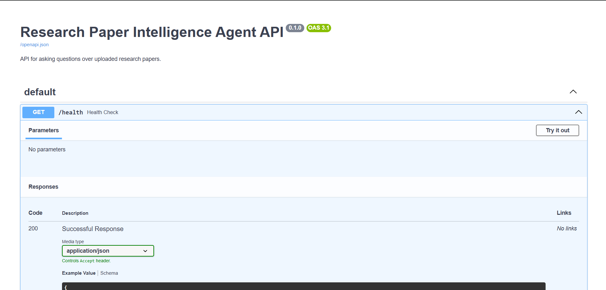
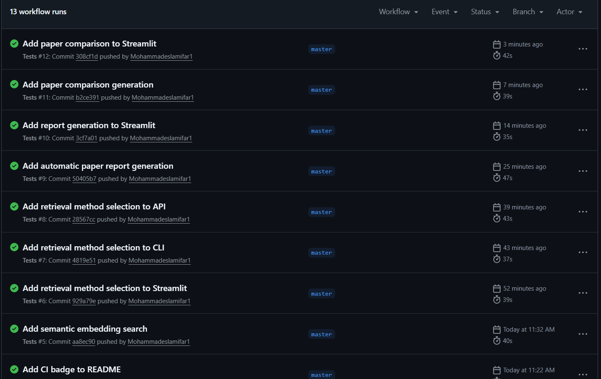

# Research Paper Intelligence Agent

[](https://github.com/Mohammadeslamifar1/intelligence_agent_research_paper/actions/workflows/tests.yml)

Research Paper Intelligence Agent is an AI engineering project that helps users analyze academic PDF papers.

The system extracts text from uploaded research papers, splits the content into searchable chunks, retrieves relevant context for a user question, answers questions with source references, generates structured paper reports, and compares multiple papers.

The goal of this project is to demonstrate practical AI engineering skills including document processing, semantic retrieval, question answering, report generation, API development, testing, Docker support, and web app deployment.

## Project Status

Current version: working AI engineering prototype.

Implemented features:

1. PDF text extraction
2. Text chunking with overlap
3. TF IDF keyword retrieval
4. Semantic embedding retrieval with Sentence Transformers
5. Extractive question answering
6. Interactive command line assistant
7. Streamlit web demo
8. FastAPI backend
9. Automatic paper report generation
10. Multi paper comparison report generation
11. Docker support
12. GitHub Actions continuous integration
13. Unit tests for core pipeline components

## Demo

### Streamlit Web App



### Question Answering With Sources



### Automatic Paper Report



### Paper Comparison Report



### FastAPI Documentation



### GitHub Actions



## Example Use Case

The project was tested with research papers about Sloan Digital Sky Survey quasar catalogs.

Example questions:

```text
What is the main contribution of this paper?
What data does this paper use?
What physical quantities are included in the catalog?
What are the limitations mentioned in the paper?
Compare the main contributions of the uploaded papers.
Compare the datasets used by the uploaded papers.
```

## Architecture

```text
PDF Papers
    |
    v
PDF Loader
    |
    v
Text Chunker
    |
    v
Retrieval Layer
    |
    |      TF IDF keyword search
    |      Semantic embedding search
    |
    v
Extractive QA Engine
    |
    v
Report Generator
    |
    v
Comparison Generator
    |
    v
CLI App, Streamlit App, FastAPI Backend
```

## Project Structure

```text
research_paper_intelligence_agent
    app
        api
            main.py
        generation
            comparison_generator.py
            qa_engine.py
            report_generator.py
        ingestion
            chunker.py
            pdf_loader.py
        retrieval
            embedding_search_engine.py
            search_engine.py
        ui
            streamlit_app.py
        pipeline.py
    data
        papers
    docs
        images
    scripts
        ask.py
        compare_papers.py
        generate_report.py
        test_chunker.py
        test_embedding_search.py
        test_pdf_loader.py
        test_qa.py
        test_search.py
    tests
        test_pipeline_components.py
    .github
        workflows
            tests.yml
    Dockerfile
    compose.yaml
    requirements.txt
    requirements_embeddings.txt
    pytest.ini
    README.md
```

## Setup

Create and activate a virtual environment.

For Windows PowerShell:

```powershell
python -m venv .venv
.\.venv\Scripts\Activate.ps1
```

Install core dependencies:

```powershell
pip install -r requirements.txt
```

Install semantic search dependencies:

```powershell
pip install -r requirements_embeddings.txt
```

## Add Papers

Place one or more PDF research papers inside:

```text
data\papers
```

The command line assistant and FastAPI backend read papers from this folder.

The Streamlit app also supports direct PDF upload through the browser.

## Run the Command Line Assistant

```powershell
python scripts\ask.py
```

The assistant lets the user choose between:

```text
TF IDF keyword search
Semantic embedding search
```

Then it builds the index and allows interactive questions.

## Generate a Paper Report From Terminal

```powershell
python scripts\generate_report.py
```

The generated report is saved to:

```text
results\paper_report.md
```

The report includes:

1. Main contribution
2. Data used
3. Methodology
4. Measured results
5. Limitations
6. Source chunks

## Compare Papers From Terminal

Add at least two papers to:

```text
data\papers
```

Then run:

```powershell
python scripts\compare_papers.py
```

The generated comparison report is saved to:

```text
results\paper_comparison_report.md
```

The comparison report includes:

1. Main contributions
2. Data used
3. Methodology
4. Reported results
5. Limitations
6. Source chunks

## Run the Streamlit Demo

```powershell
streamlit run app\ui\streamlit_app.py
```

In the browser, the user can:

1. Upload one or more PDF files
2. Choose TF IDF or semantic retrieval
3. Build the assistant
4. Ask questions
5. View source chunks
6. Generate a paper report
7. Compare uploaded papers
8. Download reports as Markdown files

## Run the FastAPI Backend

```powershell
uvicorn app.api.main:app
```

Open the API documentation in the browser:

```text
http://127.0.0.1:8000/docs
```

Use the endpoints in this order:

```text
GET /health
POST /build
POST /ask
```

Example request body for POST /build:

```json
{
  "retrieval_method": "semantic"
}
```

Example request body for POST /ask:

```json
{
  "question": "What is the main contribution of this paper?"
}
```

Available retrieval methods:

```text
tfidf
semantic
```

## Run With Docker

Build and run the Streamlit app with Docker Compose:

```powershell
docker compose up
```

Then open:

```text
http://localhost:8501
```

To stop the app, press:

```text
Ctrl C
```

## Run Tests

```powershell
pytest
```

Tests are also executed automatically on GitHub Actions for every push to the master branch.

## Retrieval Methods

### TF IDF Keyword Search

This method is fast, local, simple, and does not require model downloads or API keys.

It works well when the user question uses terms that appear directly in the paper.

### Semantic Embedding Search

This method uses Sentence Transformers to encode paper chunks and user questions into vector embeddings.

It works better when the user asks questions using different wording from the original paper.

## Current Limitations

1. The current QA layer is extractive, so answers are generated from selected paper sentences rather than rewritten by a large language model.
2. Semantic search requires downloading an embedding model on first use.
3. The system currently stores indexes in memory.
4. The comparison report depends on retrieval quality and can improve with stronger generation models.
5. PDF parsing may be less accurate for scanned documents or papers with complex layouts.

## Planned Improvements

1. Add LLM based answer generation
2. Add citation aware answers with page references
3. Add persistent vector database support
4. Add uploaded file storage management
5. Add paper metadata extraction
6. Add evaluation metrics for retrieval and answer quality
7. Add hosted deployment
8. Add better UI styling and paper cards

## Tech Stack

Python

PyMuPDF

Scikit learn

Sentence Transformers

NumPy

FastAPI

Pydantic

Streamlit

Pytest

Docker

GitHub Actions

## Resume Description

Built a full stack research paper intelligence agent that extracts text from academic PDFs, chunks documents, retrieves relevant context with both TF IDF and semantic embedding search, answers user questions with source references, generates structured paper reports, compares multiple papers, and exposes the system through a command line app, Streamlit interface, and FastAPI backend.

Implemented modular Python components, automated tests, Docker support, GitHub Actions continuous integration, and a clean project structure for maintainable AI engineering development.